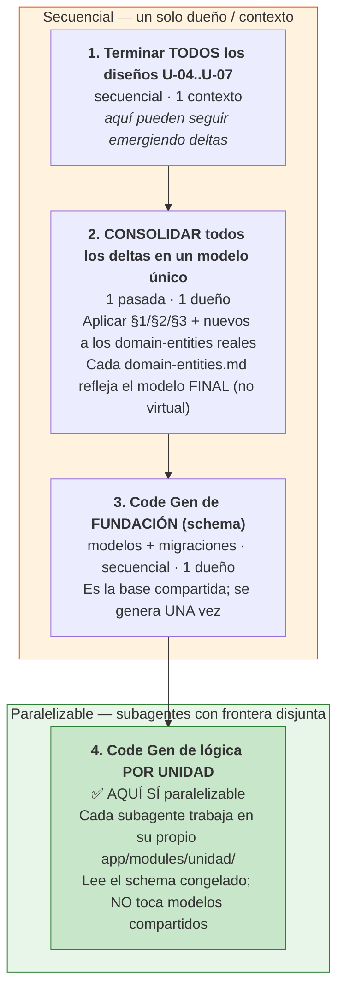

# Plan para solucionar Cross-Unit Deltas con subagentes paralelos

> **Fecha**: 2026-05-29
> **Contexto**: Decisión de ejecutar el Code Generation repartiendo unidades a diferentes subagentes (ejecución paralela). Este documento captura por qué los cross-unit-deltas causan problemas en ese escenario y cuál es la estrategia para evitarlos.
> **Estado**: PLAN — aplicar cuando lleguemos a la fase de Code Generation.

---

## TL;DR

Los cross-unit-deltas **son el acoplamiento entre unidades** (representan un modelo de datos compartido). La estrategia actual "Opción C" (aplicar el delta al inicio del Code Gen de cada unidad) fue diseñada para **ejecución secuencial de un solo agente** y **NO compone con subagentes paralelos**.

**Solución**: separar la generación de la **fundación/schema compartido** (una pasada, un dueño) de la **lógica de negocio por unidad** (paralelizable). Congelar el schema antes de repartir trabajo.

---

## Por qué los deltas causan problemas

Los cross-unit-deltas no son tareas sueltas: son la evidencia de que las unidades comparten un modelo de datos.

| Sección de `cross-unit-deltas.md` | Contenido | Implica |
|---|---|---|
| §1 (U-01) | 5 entidades nuevas (`CatalogoVariable`, `LlamadaLLM`, `SolicitudCotizacion`, `ItemSolicitud`, `ItemCotizado`) + `ALTER TABLE` sobre `portafolio`, `cotizacion`, `documento_pdf`, `discrepancia`, `variable_extraida` | Schema compartido |
| §2 (U-02) | `RepositorioSAB` que **persiste esas mismas entidades** (jerarquía Portafolio→SolicitudCotizacion→Cotizacion→ItemCotizado) | U-02 depende del schema de U-01 |
| §3 (U-06) | CRUD de `CatalogoVariable` (entidad definida en §1) | U-06 depende del schema de U-01 |

→ U-02 y U-06 **dependen de que el schema de U-01 ya exista**. No son independientes.

---

## Los 4 problemas concretos con subagentes paralelos

| # | Problema | Por qué pasa |
|---|---|---|
| 1 | **Colisión en archivos compartidos** | El subagente de "Code Gen U-01" crea los modelos SQLAlchemy + migración Alembic de `solicitud_cotizacion`, etc. El de "U-02" asume esas tablas y las puebla. Ambos tocan `app/models/` y migraciones → conflictos de merge y orden de migración ambiguo |
| 2 | **Dependencia oculta (no son paralelas)** | El schema de U-01 *debe* aterrizar antes que el código de U-02/U-03/U-06 que lo lee. Es un DAG, no unidades planas |
| 3 | **"Asumido como aplicado" no sobrevive entre contextos** | Hoy funciona porque un solo agente mantiene en contexto "los deltas están aplicados virtualmente". Un subagente fresco asignado solo a "U-02" leería el `domain-entities.md` de U-01 **que todavía tiene el modelo viejo** (`numero_proceso`) y construiría contra el modelo equivocado, salvo que le inyectes los deltas explícitamente |
| 4 | **Acumulación concurrente** | Si U-04/U-05 corren en paralelo y cada uno puede emitir deltas hacia otras unidades, habría escrituras concurrentes a `cross-unit-deltas.md` |

**Causa de fondo**: la estrategia "Opción C" asume ejecución secuencial de un solo agente.

---

## La solución: separar "fundación/schema" de "lógica por unidad"

### Claves para que los subagentes no colisionen

- **Frontera de archivos disjunta**: cada unidad dueña de su `app/modules/{unidad}/`; los modelos/migraciones compartidos los genera la pasada de fundación, no los subagentes.
- **Schema congelado y único como fuente de verdad** antes de repartir — eliminando el split actual entre el `domain-entities.md` (stale) y el `cross-unit-deltas.md`.
- **(Opcional) git worktree por subagente** para aislar, pero solo funciona si los archivos son disjuntos — por eso el punto anterior es el que realmente resuelve.

---

## Recomendaciones prácticas

1. **No paralelizar el Code Gen por unidad como tareas planas independientes.** Sí se puede paralelizar la **lógica de negocio** por unidad, pero solo después de congelar el schema compartido.
2. **Antes del Code Gen**, consolidar los deltas en los `domain-entities.md` reales (cuando todos los diseños estén listos), para que ningún subagente dependa de "saber" que existe un archivo de deltas.
3. **El diseño SÍ se puede repartir más fácil** que el código — las unidades de diseño son más independientes (cada una produce sus propios artefactos en su carpeta). El riesgo de colisión aparece sobre todo en Code Gen.

---

## Checklist para cuando lleguemos a Code Generation

- [ ] Todos los diseños de U-01..U-07 completos
- [ ] Recopilar TODOS los cross-unit-deltas acumulados (no solo los de U-03)
- [ ] Aplicar deltas a los `domain-entities.md` de cada unidad afectada → modelo final consolidado
- [ ] Re-validar con el usuario el modelo consolidado
- [ ] Definir frontera de archivos por unidad (`app/modules/{unidad}/`) y dueño del schema compartido (`app/models/` + migraciones)
- [ ] Code Gen de fundación/schema (1 pasada secuencial)
- [ ] Code Gen de lógica por unidad (paralelizable, subagentes con frontera disjunta)
- [ ] Resolver gate operacional: cuenta Anthropic API (la suscripción Claude Max no la habilita)

---

## Referencias

- `aidlc-docs/construction/u03-extraccion/functional-design/cross-unit-deltas.md` — deltas actuales (§1 U-01, §2 U-02, §3 U-06, §4 TBDs operacionales)
- `aidlc-docs/aidlc-state.md` — sección "Cross-Unit Deltas Pendientes (estrategia Opción C)"
- Decisión 2026-05-27 — diferir Code Generation hasta completar todos los diseños
