# Execution Plan — Assistent Buy AI Agent

> **Versión**: 1.0  
> **Fecha**: 2026-05-23  
> **Tipo de Proyecto**: Greenfield  
> **Generado por**: AIDLC Workflow Planning

---

## Análisis de Impacto Detallado

### Transformation Scope
- **Tipo**: Nueva aplicación completa (Greenfield — no existe código previo)
- **Cambios primarios**: Construir desde cero 6 módulos funcionales + frontend SPA + backend API + pipeline de IA + integración con SAB + infraestructura cloud
- **Componentes relacionados**: No aplica (no hay sistema previo)

### Change Impact Assessment

| Área de impacto | Aplica | Descripción |
|---|---|---|
| **Cambios para el usuario** | ✅ Sí | Sistema completamente nuevo para 4 personas (Analista, Director/Admin, CISO, Comité) |
| **Cambios estructurales** | ✅ Sí | Nueva arquitectura: SPA Angular + FastAPI + PostgreSQL + Document AI cloud + LLM Anthropic + SMTP/IMAP |
| **Cambios en modelo de datos** | ✅ Sí | Nuevo esquema PostgreSQL: Portafolios, Cotizaciones, PDFs, Variables, Discrepancias, Aclaraciones, AuditTrail |
| **Cambios en APIs** | ✅ Sí | Nueva API REST (FastAPI) con todos los endpoints del sistema |
| **Impacto en NFRs** | ✅ Sí | Security Baseline (15 reglas bloqueantes) + PBT Parcial (5 reglas bloqueantes) + métricas de precisión |

### Risk Assessment

| Factor | Evaluación |
|---|---|
| **Nivel de riesgo** | 🟠 **Alto** |
| **Complejidad de rollback** | Moderada — sistema nuevo, sin datos de producción en desarrollo |
| **Complejidad de testing** | Alta — precisión >96%, ASR <2%, 0 EchoLeak, pipeline Zero Trust verificable |
| **Incógnitas principales** | Comportamiento del LLM en PDFs adversariales del corpus D3; latencia real de Document AI cloud sobre PDFs complejos |
| **Mitigaciones** | Gates de calidad Go/No-Go antes de piloto; corpus de prueba D1-D3 definido en PRD; Security Baseline bloqueante |

---

## Workflow Visualization

```mermaid
flowchart TD
    Start(["📋 Assistent Buy<br/>AI Agent"])

    subgraph INCEPTION["🔵 INCEPTION PHASE"]
        WD["Workspace Detection<br/><b>✅ COMPLETED</b>"]
        RE["Reverse Engineering<br/><b>⏭️ SKIPPED (Greenfield)</b>"]
        RA["Requirements Analysis<br/><b>✅ COMPLETED</b>"]
        US["User Stories<br/><b>✅ COMPLETED</b>"]
        WP["Workflow Planning<br/><b>🔄 IN PROGRESS</b>"]
        AD["Application Design<br/><b>▶️ EXECUTE</b>"]
        UP["Units Planning<br/><b>▶️ EXECUTE</b>"]
        UG["Units Generation<br/><b>▶️ EXECUTE</b>"]
    end

    subgraph CONSTRUCTION["🟢 CONSTRUCTION PHASE"]
        FD["Functional Design<br/><b>▶️ EXECUTE</b>"]
        NFRA["NFR Requirements<br/><b>▶️ EXECUTE</b>"]
        NFRD["NFR Design<br/><b>▶️ EXECUTE</b>"]
        ID["Infrastructure Design<br/><b>▶️ EXECUTE</b>"]
        CG["Code Generation<br/>(Planning + Generation)<br/><b>▶️ EXECUTE</b>"]
        BT["Build and Test<br/><b>▶️ EXECUTE</b>"]
    end

    subgraph OPERATIONS["🟡 OPERATIONS PHASE"]
        OPS["Operations<br/><b>📌 PLACEHOLDER</b>"]
    end

    Start --> WD
    WD --> RE
    RE --> RA
    RA --> US
    US --> WP
    WP --> AD
    AD --> UP
    UP --> UG
    UG --> FD
    FD --> NFRA
    NFRA --> NFRD
    NFRD --> ID
    ID --> CG
    CG --> BT
    BT --> OPS
    OPS --> End(["🎯 MVP Listo para Piloto"])

    style WD fill:#4CAF50,stroke:#1B5E20,stroke-width:3px,color:#fff
    style RE fill:#BDBDBD,stroke:#424242,stroke-width:2px,stroke-dasharray: 5 5,color:#000
    style RA fill:#4CAF50,stroke:#1B5E20,stroke-width:3px,color:#fff
    style US fill:#4CAF50,stroke:#1B5E20,stroke-width:3px,color:#fff
    style WP fill:#FFA726,stroke:#E65100,stroke-width:3px,color:#000
    style AD fill:#FFA726,stroke:#E65100,stroke-width:3px,stroke-dasharray: 5 5,color:#000
    style UP fill:#FFA726,stroke:#E65100,stroke-width:3px,stroke-dasharray: 5 5,color:#000
    style UG fill:#FFA726,stroke:#E65100,stroke-width:3px,stroke-dasharray: 5 5,color:#000
    style FD fill:#FFA726,stroke:#E65100,stroke-width:3px,stroke-dasharray: 5 5,color:#000
    style NFRA fill:#FFA726,stroke:#E65100,stroke-width:3px,stroke-dasharray: 5 5,color:#000
    style NFRD fill:#FFA726,stroke:#E65100,stroke-width:3px,stroke-dasharray: 5 5,color:#000
    style ID fill:#FFA726,stroke:#E65100,stroke-width:3px,stroke-dasharray: 5 5,color:#000
    style CG fill:#FFA726,stroke:#E65100,stroke-width:3px,stroke-dasharray: 5 5,color:#000
    style BT fill:#FFA726,stroke:#E65100,stroke-width:3px,stroke-dasharray: 5 5,color:#000
    style OPS fill:#FFF59D,stroke:#F57F17,stroke-width:2px,color:#000
    style Start fill:#CE93D8,stroke:#6A1B9A,stroke-width:3px,color:#000
    style End fill:#CE93D8,stroke:#6A1B9A,stroke-width:3px,color:#000
    linkStyle default stroke:#333,stroke-width:2px
```

---

## Fases a Ejecutar

### 🔵 INCEPTION PHASE

| Fase | Estado | Rationale |
|---|---|---|
| Workspace Detection | ✅ COMPLETED | — |
| Reverse Engineering | ⏭️ SKIPPED | Proyecto Greenfield — no hay código existente |
| Requirements Analysis | ✅ COMPLETED | 7 grupos RF, stack definido, Security Baseline + PBT |
| User Stories | ✅ COMPLETED | 25 stories, 5 personas, 6 épicas Gherkin |
| **Workflow Planning** | 🔄 IN PROGRESS | — |
| **Application Design** | ▶️ **EXECUTE** | Sistema nuevo con 6 módulos, 4 capas (SPA, API, IA, Datos), múltiples integraciones — diseño de componentes es obligatorio |
| **Units Planning** | ▶️ **EXECUTE** | Nuevo esquema de BD, nuevos endpoints API, algoritmos de extracción y cruce, pipeline de sanitización — todo requiere planificación de unidades |
| **Units Generation** | ▶️ **EXECUTE** | Implementación completa del sistema — obligatorio para un proyecto Greenfield |

### 🟢 CONSTRUCTION PHASE

| Fase | Estado | Rationale |
|---|---|---|
| **Functional Design** | ▶️ **EXECUTE** | Reglas de negocio complejas: motor de extracción, cruce de datos, clasificación de discrepancias, generación de borradores — requieren diseño funcional detallado con PBT-01 (identificación de propiedades) |
| **NFR Requirements** | ▶️ **EXECUTE** | Security Baseline (15 reglas bloqueantes), PBT Parcial (5 reglas), métricas de precisión >96%, ASR <2%, latencia ≤60s — todos son NFRs formales que requieren esta fase |
| **NFR Design** | ▶️ **EXECUTE** | Las NFRs de seguridad requieren diseño explícito: Zero Trust pipeline, autenticación OAuth2, cifrado en tránsito/reposo, rate limiting, CORS — no son triviales |
| **Infrastructure Design** | ▶️ **EXECUTE** | Infraestructura cloud nueva: API Gateway, contenedores Docker, PostgreSQL managed, integración Document AI, SMTP/IMAP, bucket de almacenamiento — requiere diseño IaC |
| **Code Generation** | ▶️ **EXECUTE** (SIEMPRE) | Implementación del sistema completo |
| **Build and Test** | ▶️ **EXECUTE** (SIEMPRE) | Build, tests unitarios + integración + PBT + security checks, gates de calidad Go/No-Go |

### 🟡 OPERATIONS PHASE

| Fase | Estado | Rationale |
|---|---|---|
| Operations | 📌 PLACEHOLDER | Definir runbooks, monitoreo post-piloto, alertas de producción — posterior al MVP |

---

## Secuencia de Componentes a Construir

Para un proyecto Greenfield de esta complejidad, la secuencia lógica de construcción es:

| Orden | Componente | Dependencias | Prioridad |
|---|---|---|---|
| 1 | **Capa de datos** (esquema PostgreSQL + modelos) | Ninguna | Crítica — todo lo demás depende |
| 2 | **Módulo de Ingesta** (M1, M2: SAB BD + filesystem) | Capa de datos | Crítica — entrada del pipeline |
| 3 | **Pipeline de Sanitización** (M3, M4: Zero Trust + Spotlighting) | Módulo de Ingesta | Crítica — SECURITY bloqueante |
| 4 | **Motor de Extracción** (M5: Document AI + LLM Claude) | Pipeline de Sanitización | Crítica — núcleo del valor |
| 5 | **Motor de Cruce** (M6, M7, M8: discrepancias + confianza + escalamiento) | Motor de Extracción | Crítica |
| 6 | **Autenticación y Autorización** (OAuth2, roles) | Capa de datos | Crítica — SECURITY bloqueante |
| 7 | **API REST FastAPI** (todos los endpoints) | Módulos 1-6 + Auth | Crítica |
| 8 | **Módulo HITL** (M9, M10: borradores + aprobación + SMTP/IMAP) | API REST | Alta |
| 9 | **Módulo de Reportes** (M11, M12: síntesis + export PDF) | Motor de Cruce | Alta |
| 10 | **Frontend SPA Angular** (todas las vistas) | API REST completa | Alta |
| 11 | **Módulo Admin** (logs, alertas, panel CISO) | API REST | Media |
| 12 | **Infraestructura IaC** (Docker, cloud, CI/CD) | Todo lo anterior | Crítica para despliegue |

---

## Criterios de Éxito (Gates Go/No-Go)

| Gate | Criterio | Umbral | Fase de verificación |
|---|---|---|---|
| G1 | Precisión de extracción (corpus D2) | > 96% | Build and Test |
| G2 | ASR de IPI (corpus D3) | < 2% | Build and Test |
| G3 | Tasa de alucinación | < 1% | Build and Test |
| G4 | Exfiltraciones EchoLeak | 0 incidentes | Build and Test |
| G5 | Consistencia entre ejecuciones | > 95% | Build and Test |
| G6 | Security Baseline — todas las reglas | 100% compliant | Code Generation + Build and Test |
| G7 | Latencia por portafolio denso (50 cot. / 200 PDF) | ≤ 60 segundos | Build and Test |

---

## Estimación de Timeline

| Fase | Estimación |
|---|---|
| Application Design | 1 sesión |
| Units Planning | 1-2 sesiones |
| Units Generation | 2-3 sesiones |
| Functional Design | 1-2 sesiones |
| NFR Requirements + NFR Design | 1 sesión |
| Infrastructure Design | 1 sesión |
| Code Generation (Planning) | 1 sesión |
| Code Generation (Generation) | 3-5 sesiones (por volumen de código) |
| Build and Test | 1-2 sesiones |
| **Total estimado** | **12-18 sesiones de trabajo** |

---

## Referencia de Artefactos

| Artefacto | Ruta | Estado |
|---|---|---|
| PRD | `assitant_buy_prd.md` | ✅ Leído |
| Requirements | `aidlc-docs/inception/requirements/requirements.md` | ✅ Completado |
| User Stories | `aidlc-docs/inception/user-stories/stories.md` | ✅ Completado |
| Personas | `aidlc-docs/inception/user-stories/personas.md` | ✅ Completado |
| Execution Plan | `aidlc-docs/inception/plans/execution-plan.md` | 🔄 Este documento |
