# PRD — Assistent Buy AI Agent

> **Producto**: Assistent Buy AI Agent
> **Versión**: 1.0 (MVP)
> **Fecha**: Mayo 2026
> **Autor**: Head of Product + AI/Agent Architect

---

## Tabla de Contenidos

1. [One-Liner del Producto + JTBD](#1-one-liner-del-producto--jtbd)
2. [Contexto y Problema](#2-contexto-y-problema)
3. [ICP Detallado](#3-icp-detallado)
4. [Propuesta de Valor Única y Diferenciadores](#4-propuesta-de-valor-única-uvp-y-diferenciadores)
5. [Casos de Uso Top 5](#5-casos-de-uso-top-5)
6. [Principios de Diseño No Negociables](#6-principios-de-diseño-no-negociables)
7. [User Journeys](#7-user-journeys)
8. [MVP Scope (MoSCoW)](#8-mvp-scope-moscow)
9. [Especificación Funcional: Módulos y Features](#9-especificación-funcional-módulos-y-features)
10. [Métricas de Éxito](#10-métricas-de-éxito)
11. [Plan de Evaluación del Agente](#11-plan-de-evaluación-del-agente)
12. [Riesgos y Mitigaciones](#12-riesgos-y-mitigaciones)
13. [Plan de Entrega 30/60/90 Días](#13-plan-de-entrega-306090-días)

---

## 1. One-Liner del Producto + JTBD

### One-Liner

**Assistent Buy AI Agent** es un módulo agéntico de pre-análisis técnico y comercial que se integra nativamente con SAB para cubrir el 100% de las cotizaciones y el 100% de sus anexos PDF —cruzando datos estructurados de la base de datos con el análisis semántico profundo de los documentos adjuntos— y entregar síntesis completas y listas para decisión.

### Job to be Done (JTBD)

> **Cuando** un analista de compras tiene un portafolio de cotizaciones consolidadas en SAB —con datos estructurados comparables ítem por ítem y documentos anexos en PDF que cada proveedor adjunta en su propio formato—,
> **quiero** que un agente de IA procese autónomamente la totalidad de las cotizaciones y la totalidad de sus anexos, cruzando lo que cada proveedor cotizó en el formato estructurado contra lo que declara en sus documentos adjuntos, detectando riesgos documentales, omisiones y discrepancias, y redactando solicitudes de aclaración para mi aprobación,
> **para** que ninguna cotización quede sin revisar y ningún riesgo oculto en la "letra chica" pase desapercibido, reduciendo el ciclo de evaluación de 15 días a menos de 3 días hábiles.

### Misión del Producto

Hoy, los analistas de compras seleccionan un subconjunto de cotizaciones, revisan sus documentos anexos —un proceso que toma días— y dejan fuera cotizaciones enteras porque su capacidad no les permite abarcar más. Assistent Buy elimina esa brecha de cobertura procesando la totalidad de las cotizaciones y la totalidad de sus anexos, cruzando los datos estructurados de SAB con el contenido no estructurado de los PDFs adjuntos. El producto prioriza la precisión extrema sobre la velocidad, porque en decisiones de adjudicación de alto riesgo, una cotización que nunca se leyó puede contener la mejor oferta o el peor riesgo.

---

## 2. Contexto y Problema

### 2.1. Dolores del Mercado

#### El cuello de botella cognitivo en compras corporativas

| Dolor | Dato duro | Fuente |
|-------|-----------|--------|
| **Tiempo perdido en revisión manual** | Los equipos de compras pierden hasta **15 horas semanales** dedicadas exclusivamente a la revisión manual de documentos de licitación. | docs_overview.md §1 |
| **Cotizaciones descartadas sin leer** | El **80% de las cotizaciones** consolidadas en los sistemas de almacenamiento se descartan a ciegas, sin una revisión real de su contenido no estructurado. | pvd.md §1 |
| **Datos disponibles desaprovechados** | La toma de decisiones financieras se realiza utilizando **menos del 20%** de los datos disponibles en el histórico documental. | validacion.md §2 |
| **Compras como operador, no como estrategia** | El **61% de las organizaciones** en Colombia percibe la función de compras como un mero "operador administrativo" desconectado de los objetivos de negocio. | validacion.md §3 |
| **Brecha tecnológica endémica** | El **71% de las empresas** en Colombia opera con un modelo híbrido de ERP rígido + hojas de cálculo manuales para soportar la cadena de suministro. | validacion.md §3 |
| **Cobertura parcial del gasto** | El **53% de las áreas de abastecimiento** en Colombia gestiona menos del 80% del gasto total de sus compañías. | validacion.md §3 |

#### La "trampa del precio": cuando ahorrar cuesta más

> [!WARNING]
> El dolor más peligroso no es la lentitud — es la **falsa sensación de ahorro**.

> *"Celebrar un ahorro nominal del 40% en el costo unitario de un insumo suele ocultar ineficiencias, riesgos legales o penalidades no detectadas en los anexos que representan **sobrecostos de hasta el 120%** para el área de finanzas."* — validacion.md §3

Los elementos que se esconden en la "letra chica" incluyen:
- Periodos de validez de la oferta extremadamente cortos
- Cláusulas de exclusión perjudiciales
- Esquemas de penalizaciones asimétricas
- Vigencias, garantías y pólizas con condiciones desfavorables

### 2.2. ¿Por qué ahora?

#### 1. La IA agéntica alcanzó madurez operativa

Para finales de 2026, el **40% de las aplicaciones de software empresarial** tendrán integrados agentes de IA para tareas de mediana complejidad. Para 2030, el **50% de las soluciones de gestión de cadena de suministro transfronteriza** emplearán agentes inteligentes para decisiones autónomas.

#### 2. El mercado de IA en procurement explota

El mercado de IA para adquisiciones crecerá de **$1.9B (2023) a $22.6B (2033)**, un CAGR del **28.1%**. Integrar IA en adquisiciones puede reducir costos operativos brutos en un **20%** y disparar la productividad humana en un **70%**.

#### 3. El entorno regulatorio colombiano exige transparencia

Colombia tiene un entramado regulatorio que crea demanda de herramientas de auditoría documental:
- La **SIC** mantiene grupos activos anti-colusión desde 2009
- El **Estatuto Anticorrupción** (Ley 1474/2011) criminalizó los carteles
- **SECOP II** exige transparencia en expedientes electrónicos de contratación pública
- La **Open Contracting Partnership** exige publicar información de adquisiciones

#### 4. Los ERPs están cerrando sus ecosistemas → ventana para independientes

La **Directiva de APIs v4 de SAP** (vigente desde abril 2026) prohíbe la integración con agentes de IA de terceros. Esto crea un vacío: las empresas que NO usan SAP necesitan soluciones de IA independientes.

> [!NOTE]
> **Esto refuerza la estrategia de Fase 1 con SAB.** Al ser producto propio, no enfrentamos las restricciones de APIs hostiles. La barrera de SAP se convierte en ventaja competitiva.

#### 5. LatAm tiene la brecha más grande y la mayor urgencia

El **74% de los directivos de compras** en Colombia reconoce que la rentabilidad es su mayor desafío, pero el **71%** sigue operando con ERP + Excel.

### 2.3. Alternativas actuales

| Alternativa | Qué hace | Por qué es insuficiente |
|-------------|----------|------------------------|
| **Revisión manual (status quo)** | El analista selecciona un subconjunto de cotizaciones y revisa sus anexos. | 80% queda sin revisar. Ciclo de 15 días. |
| **Wherex (WAI)** | Marketplace transaccional con IA para sugerir proveedores. | No analiza PDFs en formato libre. No cruza datos estructurados vs. no estructurados. |
| **Egixia** | Plataforma enterprise "AI-First" con 3-Way-Match inteligente. | Excesivamente engorrosa para mid-market. |
| **Suplos** | Suite SaaS modular: tableros con IA, autogeneración de RFIs. | Carece de pre-análisis profundo de anexos no estructurados. |
| **SAP Procure AI** | Módulo nativo embebido en la suite SAP. | Solo funciona dentro del ecosistema SAP. Prohíbe agentes de terceros. |

> [!IMPORTANT]
> **La brecha que ninguna alternativa cubre**: Ninguna solución actual cruza datos estructurados de cotizaciones con el análisis semántico profundo de los documentos adjuntos en PDF. Assistent Buy opera sobre ambas simultáneamente.

---

## 3. ICP Detallado

### 3.1. Perfil de la Empresa (Firmographics)

| Dimensión | Criterio |
|-----------|----------|
| **Tamaño** | Mid-Market a Enterprise |
| **Sectores prioritarios** | Universidades, Constructoras, Manufactureras (consorcios), Sector Público |
| **Volumen transaccional** | ≥ 50 procesos de adquisición por trimestre |
| **Infraestructura** | Organizaciones que ya usen SAB (MVP) |
| **Geografía — Fase 1** | Colombia |
| **Geografía — Fase 2** | Latinoamérica (México, Chile, Perú) |

#### Vertical de lanzamiento: Universidades colombianas

1. **Gobernanza colegiada con alta carga documental**: Comités de Contratación que analizan decenas de propuestas manualmente.
2. **Presupuestos mixtos y jurisdicciones multiformes**: Fondos propios, regalías, cooperación internacional, regulaciones múltiples.
3. **Gestión dinámica de proveedores**: Reevaluación empírica anual del contratista.

### 3.2. Buyer Personas

#### Persona 1 — El Analista de Compras (Usuario Operativo Principal)

| Atributo | Detalle |
|----------|---------|
| **Rol** | Analista de Adquisiciones / Jefe de Suministros |
| **Dolor central** | *"Fatiga cognitiva por leer miles de páginas en anexos y temor a firmar autorizaciones letales por detalles ocultos en la 'letra chica'."* |
| **Motivación** | Cobertura total sin riesgo personal. |
| **Valor irresistible** | Comprimir ciclos de 15 días a <3 días hábiles con cobertura del 100%. |

#### Persona 2 — El Director de Finanzas / Cadena de Suministro

| Atributo | Detalle |
|----------|---------|
| **Rol** | Director de Finanzas, Director de Cadena de Suministro |
| **Dolor central** | *"Miedo agudo a la 'alucinación sintética' de la IA que contamine reportes financieros."* |
| **Poder** | Puede vetar la adopción si percibe riesgo de datos falsos. |
| **Cómo se gana** | Demostrar precisión obsesiva (>96%), latencia de hasta 60s aceptada como trade-off. |

#### Persona 3 — El CISO / Oficial de Seguridad

| Atributo | Detalle |
|----------|---------|
| **Rol** | CISO, Director de Tecnología, Compliance Officer |
| **Dolor central** | *"Riesgo inminente de exposición de datos (EchoLeak) e Inyección Indirecta de Prompts (IPI) vehiculizada a través de PDFs maliciosos."* |
| **Poder** | Puede bloquear la integración. |
| **Cómo se gana** | Pruebas demostrables de aislamiento hermético, sanitización matemática y Zero Trust en anexos externos. |

### 3.3. Triggers de Compra

| # | Trigger |
|---|---------|
| 1 | Auditoría interna que descubre una adjudicación defectuosa |
| 2 | Cambio de período presupuestal o ciclo de licitaciones masivas |
| 3 | Hallazgo de cláusulas perjudiciales post-adjudicación |
| 4 | Mandato regulatorio nuevo |
| 5 | Rotación del analista de compras senior |

### 3.4. Objeciones Probables

| Objeción | Respuesta |
|----------|-----------|
| *"¿Y si la IA alucina?"* | Precisión >96%, validación cruzada, HITL. |
| *"Un PDF malicioso podría manipular el análisis."* | Pipeline Zero Trust + Spotlighting + HITL. |
| *"Esto va a reemplazar a mi equipo."* | El agente NO adjudica. Genera síntesis. La decisión es humana. |
| *"Ya tenemos Wherex / Suplos."* | Assistent Buy es capa analítica sobre SAB. No reemplaza e-procurement. |
| *"¿Y si tiene sesgos?"* | Circuit-breakers algorítmicos + reportes de diversidad auditables. |

> [!WARNING]
> No se dispone de transcripciones de entrevistas con usuarios reales. Todos los pains son hipótesis del equipo pendientes de validación (5 entrevistas pre-piloto recomendadas).

---

## 4. Propuesta de Valor Única (UVP) y Diferenciadores

### 4.1. Propuesta de Valor — Una frase

> **Assistent Buy es el único módulo de pre-análisis que cruza lo que el proveedor cotizó en el formato estructurado de SAB con lo que declara en la letra chica de sus documentos adjuntos, cubriendo el 100% de las cotizaciones para que ninguna decisión de adjudicación se tome a ciegas.**

### 4.2. La Brecha de Mercado

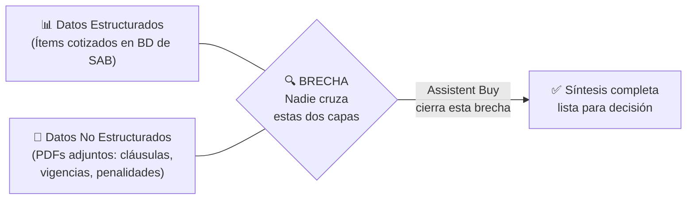

### 4.3. Matriz de Posicionamiento

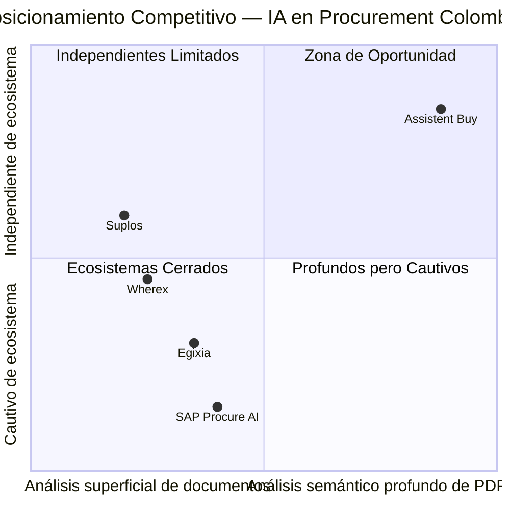

### 4.4. Tres Capas de Diferenciación

- **Capa 1 — El Cruce (ventaja de producto)**: Opera sobre datos estructurados de SAB + PDFs adjuntos simultáneamente. Detecta discrepancias entre ambas capas.
- **Capa 2 — La Distribución (ventaja de moat)**: SAB es producto propio. Canal de distribución cautivo. Integración nativa que un competidor tarda meses en replicar.
- **Capa 3 — La Filosofía (ventaja de posicionamiento)**: Precisión extrema sobre velocidad. Hasta 60s por portafolio denso.

---

## 5. Casos de Uso Top 5

### CU1: Pre-análisis masivo de cotizaciones y anexos

| Atributo | Detalle |
|----------|---------|
| **Actor** | Analista de Compras |
| **Trigger** | Se cierra el plazo de recepción de cotizaciones en SAB. |
| **Steps** | 1. Analista inicia agente sobre portafolio completo. 2. Agente ingesta 100% de datos estructurados + 100% PDFs. 3. Extrae variables críticas y cruza contra datos estructurados. 4. Genera síntesis consolidada por proveedor. 5. Analista recibe síntesis lista para decisión. |
| **Resultado** | Visibilidad completa de TODAS las cotizaciones y anexos. |
| **KPI** | Cobertura: fracción → 100%. Ciclo: 15 días → <3 días hábiles. |

### CU2: Detección de discrepancias entre datos estructurados y documentos adjuntos

| Atributo | Detalle |
|----------|---------|
| **Actor** | Analista de Compras |
| **Trigger** | Durante CU1, el agente detecta inconsistencias entre BD y PDFs. |
| **Steps** | 1. Compara ítems/precios de BD contra condiciones en PDFs. 2. Identifica discrepancias. 3. Clasifica por severidad. 4. Genera reporte con referencia a fuente. |
| **Resultado** | Riesgos invisibles al análisis de una sola capa se hacen visibles. |
| **KPI** | Tasa de detección de discrepancias. Reducción de OC defectuosas. |

### CU3: Generación de solicitudes de aclaración a proveedores (HITL)

| Atributo | Detalle |
|----------|---------|
| **Actor** | Analista de Compras + Proveedor externo |
| **Trigger** | Información faltante, ambigüedades o inconsistencias detectadas. |
| **Steps** | 1. Identifica puntos que requieren aclaración. 2. Redacta borrador de solicitud. 3. Analista revisa y aprueba. 4. Se envía al proveedor. 5. Respuesta se incorpora al análisis. |
| **Resultado** | Ambigüedades resueltas antes de adjudicación. |
| **KPI** | >80% de inconsistencias resueltas pre-adjudicación. |

### CU4: Síntesis comparativa para Comité de Contratación

| Atributo | Detalle |
|----------|---------|
| **Actor** | Analista (genera) + Comité (consume) |
| **Trigger** | Pre-análisis completo, discrepancias detectadas, aclaraciones resueltas. |
| **Steps** | 1. Analista solicita reporte comparativo. 2. Agente genera documento con ranking, matriz de cumplimiento, riesgos, trazabilidad. 3. Comité revisa y decide. |
| **Resultado** | Decisión colegiada con información completa y auditable. |
| **KPI** | Tiempo de preparación del comité. Calidad de adjudicación. |

### CU5: Detección de anomalías cuantitativas en históricos (Should Have)

| Atributo | Detalle |
|----------|---------|
| **Actor** | Director de Finanzas / Cadena de Suministro |
| **Trigger** | Acumulación de datos históricos suficientes en SAB. |
| **Steps** | 1. Accede a histórico. 2. Ejecuta análisis de anomalías. 3. Genera reporte de patrones atípicos. 4. Director decide si escalar a compliance. |
| **Resultado** | Visibilidad sobre patrones antes invisibles. |
| **KPI** | # anomalías detectadas. Índice de concentración de adjudicaciones. |

> [!WARNING]
> **CU5 NO es un sistema anti-fraude.** No detecta colusión ni garantías falsificadas. Señala patrones atípicos que requieren interpretación humana.

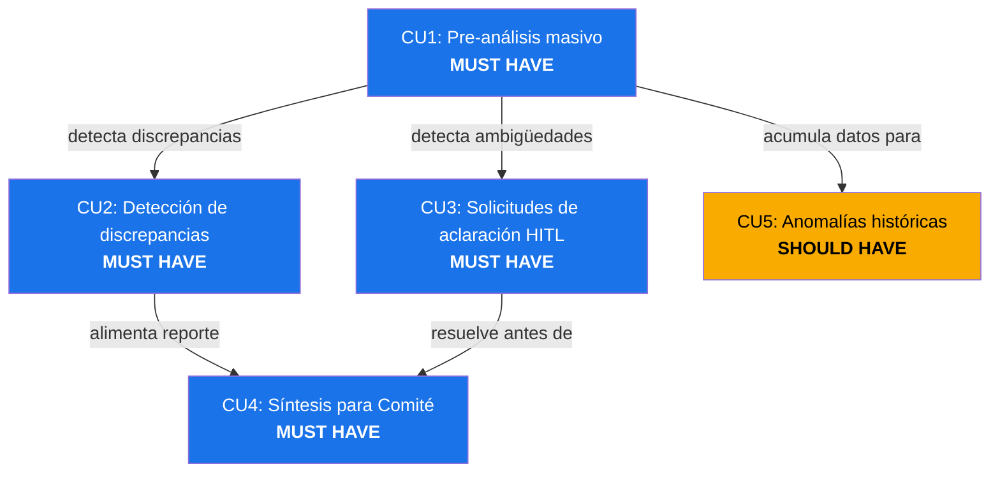

---

## 6. Principios de Diseño No Negociables

| # | Principio | Frase clave | Categoría |
|---|-----------|-------------|-----------|
| 1 | Precisión sobre velocidad | "60s de latencia es aceptable; <96% de precisión no lo es" | Calidad |
| 2 | Human-in-the-loop | "El agente sugiere; el humano decide" | Gobernanza |
| 3 | Zero Trust en documentos | "Todo PDF externo es un vector de ataque" | Seguridad |
| 4 | Trazabilidad completa | "Cada dato tiene una fuente verificable" | Auditabilidad |
| 5 | Riesgo documental, no fraude | "Detectamos anomalías, no culpables" | Posicionamiento |
| 6 | Diversidad de proveedores | "El agente no puede estrechar el mercado" | Ética |
| 7 | Capa analítica, no reemplazo | "Nos montamos encima, no competimos" | Arquitectura |

### Principio 1: Precisión sobre velocidad

- **(a) Operativamente:** SLA de latencia máxima: 60s por portafolio denso. Tasa de precisión target: >96%. Se acepta mayor costo de inferencia.
- **(b) En la interfaz:** Indicador de progreso que comunica "verificando". Indicador de confianza por variable. Variables con confianza baja destacadas.
- **(c) PROHIBIDO:** Sacrificar validación cruzada para reducir latencia. Mostrar resultados parciales como definitivos.

### Principio 2: Human-in-the-loop obligatorio

- **(a) Operativamente:** El agente nunca toma decisiones finales ni ejecuta acciones externas sin aprobación.
- **(b) En la interfaz:** Pantalla de aprobación para aclaraciones. Lenguaje: "sugiere", "detectó", "señala" — nunca "decidió".
- **(c) PROHIBIDO:** Enviar comunicaciones sin aprobación. Descartar cotizaciones automáticamente. Usar lenguaje de "decisión".

### Principio 3: Zero Trust en documentos externos

- **(a) Operativamente:** Todo PDF de proveedor pasa por pipeline de sanitización. ASR de IPI <2%.
- **(b) En la interfaz:** Estado de sanitización visible. Alertas de seguridad si se detectan elementos adversariales.
- **(c) PROHIBIDO:** Pasar contenido sin sanitizar al LLM. Incluir URLs de PDFs en comunicaciones. Filtrar datos internos.

### Principio 4: Trazabilidad completa al documento fuente

- **(a) Operativamente:** Cada dato vinculado a su fuente: PDF (página, sección) o campo de BD.
- **(b) En la interfaz:** Enlace al fragmento fuente. Notas al pie con referencias. Navegación directa al documento original.
- **(c) PROHIBIDO:** Datos sin referencia. Afirmaciones sintéticas no provenientes de los documentos.

### Principio 5: Riesgo documental, jamás anti-fraude

- **(a) Operativamente:** Detecta inconsistencias, cláusulas perjudiciales, omisiones, discrepancias. NUNCA promete detectar colusión ni fraude.
- **(b) En la interfaz:** Terminología: "riesgo documental", "discrepancia", "anomalía". Disclaimer visible en anomalías.
- **(c) PROHIBIDO:** Usar "fraude" o "colusión" en interfaz o marketing. Emitir juicios de culpabilidad.

### Principio 6: Diversidad de proveedores (Circuit-Breakers)

- **(a) Operativamente:** Mecanismos activos que previenen estrechamiento de la base de proveedores.
- **(b) En la interfaz:** Indicador de diversidad. Alerta de concentración. Métricas de distribución.
- **(c) PROHIBIDO:** Descartar proveedores por poco histórico. Penalizar formatos no convencionales.

### Principio 7: Capa analítica, no reemplazo

- **(a) Operativamente:** Se monta encima de SAB. Lee datos, no los modifica. No reemplaza a nadie.
- **(b) En la interfaz:** Se accede desde SAB como módulo complementario. Alimenta flujos existentes.
- **(c) PROHIBIDO:** Crear flujos que requieran abandonar SAB. Duplicar funcionalidades. Modificar registros en SAB.

---

## 7. User Journeys

### Journey 1: Happy Path del Analista de Compras

**Contexto:** María es analista en una universidad colombiana. 18 cotizaciones con 64 documentos adjuntos.

1. María abre el proceso en SAB y ve las 18 cotizaciones consolidadas.
2. Activa Assistent Buy. Agente confirma: *"Procesando 18 cotizaciones y 64 documentos. Tiempo estimado: ~8 minutos."*
3. Agente ingesta 100% datos estructurados + 100% PDFs (sanitización Zero Trust).
4. Extrae variables, cruza contra datos estructurados.
5. Detecta 3 discrepancias (sobrecargo no declarado, vigencia insuficiente, exclusión de garantía).
6. Detecta 2 ambigüedades que requieren aclaración.
7. Redacta 2 borradores de solicitud de aclaración.
8. María revisa, edita y aprueba envío.
9. Revisa síntesis de las 16 cotizaciones restantes.
10. Proveedores responden. Agente incorpora respuestas.
11. María solicita reporte comparativo para Comité.
12. Comité decide con visibilidad de las 18 cotizaciones (no solo 5).

> **Resultado:** Ciclo completado en 2 días. 100% auditado. 3 riesgos detectados. 2 ambigüedades resueltas.

### Journey 2: Happy Path del Director / Administrador

**Contexto:** Carlos supervisa a María y su equipo. Responsable ante Rectoría.

1. Configura reglas de negocio (umbrales de severidad, variables obligatorias, circuit-breakers).
2. Revisa dashboard de métricas (cobertura, precisión, ciclo).
3. Observa precisión 97.2%, ciclo de 14→2.5 días.
4. Recibe alerta de concentración: 85% adjudicaciones a mismos 4 proveedores.
5. Solicita reporte de anomalías cuantitativas.
6. Revisa anomalías con disclaimer. Escala 2 a auditoría interna.
7. Ajusta reglas: reduce umbral, agrega regla de proveedores nuevos.

### Journey 3: Edge Case — PDF corrupto / cotización incompleta

1. Agente detecta PDF corrupto → aísla cotización, marca "Documento no procesable", sugiere solicitar reenvío.
2. Detecta cotización sin documentos adjuntos → análisis parcial (solo estructurado), marca limitación.
3. Continúa procesando el resto del portafolio sin detenerse.
4. Síntesis final muestra: 10 completas, 1 parcial, 1 no procesable.
5. Analista decide qué hacer. **El agente nunca descartó automáticamente.**

### Journey 4: Edge Case — Ambigüedad no resoluble, escalamiento

1. Agente encuentra cláusula que referencia "Anexo C" no adjuntado.
2. Confianza cae a "baja" para la variable de penalización.
3. Agente NO inventa valor. Genera escalamiento con contexto completo.
4. Analista aprueba solicitud de aclaración.
5. Proveedor envía Anexo C. Agente lo procesa y actualiza síntesis.

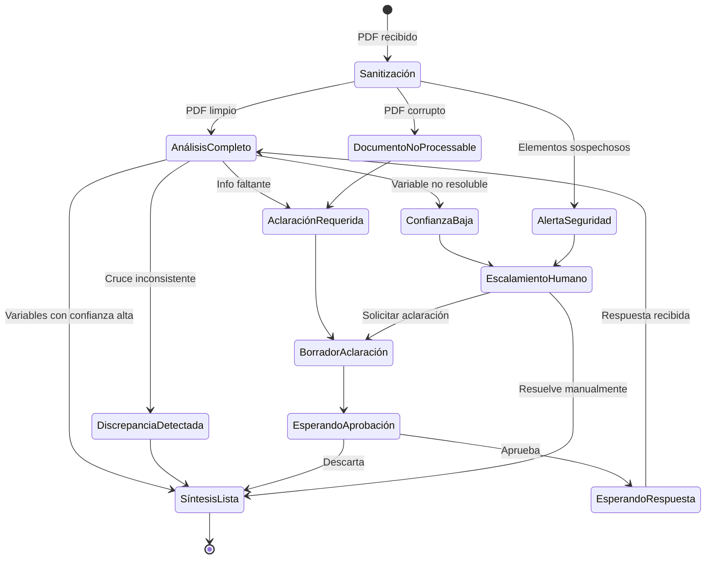

---

## 8. MVP Scope (MoSCoW)

### Must Have — Lo que DEBE estar en v1

> Sin estas features, el producto no entrega su propuesta de valor central.

#### Bloque A: Ingesta y Sanitización

| ID | Feature | Justificación |
|----|---------|---------------|
| **M1** | Conector SAB — datos estructurados (read-only) | Sin acceso a datos de BD, no hay nada que cruzar. |
| **M2** | Conector SAB — documentos adjuntos (PDFs) | Sin acceso a PDFs, no hay análisis no estructurado. |
| **M3** | Pipeline de sanitización Zero Trust | Principio #3. Sin esto, cada PDF es un vector de ataque. |
| **M4** | Spotlighting (señales de procedencia sistema vs. documento) | Defensa contra IPI documentada en docs_mercado.md §2.4. |

#### Bloque B: Análisis y Cruce

| ID | Feature | Justificación |
|----|---------|---------------|
| **M5** | Extracción de variables de PDFs (vigencias, garantías, penalidades, exclusiones) | Core de la propuesta de valor. |
| **M6** | Cruce automático datos estructurados ↔ variables de PDF | EL diferenciador. Sin cruce, somos "otro lector de PDFs". |
| **M7** | Indicador de confianza por variable extraída | Principio #1. El analista necesita saber dónde confiar y dónde verificar. |
| **M8** | Escalamiento automático a humano cuando confianza < umbral | Principio #2. Si el agente no está seguro, no inventa. |

#### Bloque C: Comunicación HITL

| ID | Feature | Justificación |
|----|---------|---------------|
| **M9** | Generación de borradores de solicitud de aclaración | CU3. Resolver ambigüedades antes de adjudicar. |
| **M10** | Pantalla de aprobación humana (revisar, editar, aprobar/descartar) | Principio #2. Sin HITL, el agente no puede comunicarse. |

#### Bloque D: Reportes y Trazabilidad

| ID | Feature | Justificación |
|----|---------|---------------|
| **M11** | Síntesis por proveedor (con trazabilidad a fuente) | Principio #4. CU4. El output principal del agente. |
| **M12** | Reporte comparativo para Comité de Contratación | CU4. El entregable que demuestra el valor al decisor final. |

### Should Have — Alto valor, no crítico para v1

| ID | Feature | Timing estimado | Justificación del diferimiento |
|----|---------|----------------|-------------------------------|
| **S1** | Detección de anomalías cuantitativas en histórico de proveedores | v1.1 (post-piloto, requiere ≥3 meses de datos acumulados) | CU5. Sin histórico suficiente, no hay patrones que detectar. |
| **S2** | Circuit-breakers algorítmicos (diversidad de proveedores) | v1.1 (requiere S1 como input) | Principio #6. Depende de datos de concentración acumulados. |
| **S3** | Dashboard de métricas para administrador | v1.1 (post-piloto, cuando hay datos que mostrar) | Valor operativo para Carlos (Persona 2). Sin datos del piloto, el dashboard está vacío. |
| **S4** | Configuración de reglas de negocio por cliente | v1.2 | En v1, las reglas son fijas. Post-piloto se parametrizan según feedback. |
| **S5** | Indicador de diversidad de proveedores (reporte) | v1.1 (requiere S1) | Complementa S2. Visible para directores. |

### Could Have — Diferenciadores futuros

| ID | Feature | Horizonte |
|----|---------|-----------|
| **C1** | Conectores a ERPs externos (SAP Business One, Oracle, Dynamics) | Fase 2 (6-12 meses) |
| **C2** | Evaluación automática de proveedores basada en desempeño histórico | Fase 2 |
| **C3** | Integración con SECOP II para contratación pública | Fase 2 (requiere exploración API) |
| **C4** | Soporte multi-idioma (inglés, portugués) para LatAm | Fase 2 (expansión geográfica) |
| **C5** | Análisis predictivo de precios basado en tendencias históricas | Fase 3 (requiere masa crítica de datos) |

### Won't Have (por ahora)

| ID | Feature excluida | Razón de exclusión |
|----|-----------------|-------------------|
| **W1** | Comunicación autónoma con proveedores (sin aprobación humana) | Principio #2. Riesgo EchoLeak. |
| **W2** | Detección de fraude o colusión | Principio #5. Posicionamiento explícito: riesgo documental, no anti-fraude. |
| **W3** | Adjudicación automática | Principio #2. Responsabilidad legal inaceptable. |
| **W4** | Integración directa con API de ERPs externos | Fase 2. Riesgo de cierre de APIs. |
| **W5** | Escritura en SAB (modificar registros) | Principio #7. Capa de solo lectura. |
| **W6** | Negociación automática de precios con proveedores | Combinación de W1 + W3. |

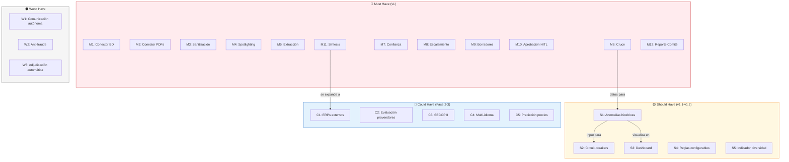

---

## 9. Especificación Funcional: Módulos y Features

### Arquitectura Funcional de Alto Nivel

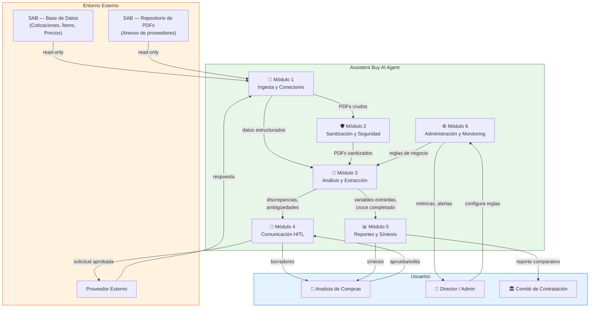

### Roles y Permisos

| Rol | Descripción | Acceso |
|-----|-------------|--------|
| **Analista** | Usuario operativo principal | Inicia análisis, revisa síntesis, aprueba aclaraciones, genera reportes |
| **Admin** | Director / Supervisor | Todo lo del Analista + configurar reglas, ver métricas, gestionar alertas |
| **Sistema** | El agente | Ejecuta análisis, genera síntesis, redacta borradores. NUNCA ejecuta acciones externas sin aprobación. |
| **Comité** | Rol de solo lectura | Accede a reportes comparativos finales |

> [!IMPORTANT]
> **Ningún rol tiene acceso de escritura a SAB.** La integración es 100% read-only. Principio #7.

### Módulo 1 — Ingesta y Conectores

| Atributo | Detalle |
|----------|---------|
| **Propósito** | Obtener datos de SAB (estructurados + documentos) de forma segura y eficiente. |
| **Features MVP** | M1 (conector BD read-only), M2 (conector documentos) |
| **Roles** | Sistema (ejecuta), Admin (configura conexión) |
| **Pantallas** | Config. de conexión SAB (Admin), Estado de ingesta (Analista) |

### Módulo 2 — Sanitización y Seguridad

| Atributo | Detalle |
|----------|---------|
| **Propósito** | Neutralizar vectores de ataque en PDFs antes de enviarlos al LLM. |
| **Features MVP** | M3 (pipeline Zero Trust), M4 (Spotlighting) |
| **Roles** | Sistema (ejecuta automáticamente) |
| **Pantallas** | Log de sanitización (Admin), Alertas de seguridad (Admin) |

### Módulo 3 — Análisis y Extracción

| Atributo | Detalle |
|----------|---------|
| **Propósito** | Extraer variables, cruzar datos, detectar discrepancias, clasificar riesgos. |
| **Features MVP** | M5, M6, M7, M8 |
| **Roles** | Sistema (ejecuta), Analista (consume resultados) |
| **Pantallas** | Vista de análisis por proveedor, Detalle de discrepancias, Indicadores de confianza |

### Módulo 4 — Comunicación HITL

| Atributo | Detalle |
|----------|---------|
| **Propósito** | Gestionar solicitudes de aclaración con aprobación humana obligatoria. |
| **Features MVP** | M9, M10 |
| **Roles** | Sistema (redacta), Analista (aprueba), Proveedor (responde) |
| **Pantallas** | Bandeja de borradores pendientes, Editor de aclaración, Histórico |

### Módulo 5 — Reportes y Síntesis

| Atributo | Detalle |
|----------|---------|
| **Propósito** | Consolidar los resultados del análisis en formatos consumibles para decisión. |
| **Features MVP** | M11, M12 |
| **Roles** | Sistema (genera), Analista (revisa), Comité (consume) |
| **Pantallas** | Síntesis por proveedor, Reporte comparativo, Export PDF |

### Módulo 6 — Administración y Monitoring

| Atributo | Detalle |
|----------|---------|
| **Propósito** | Supervisión operativa, configuración de reglas, métricas de calidad. |
| **Features MVP** | Básico: logs, alertas. Completo en S3 (Should Have). |
| **Roles** | Admin (configura y monitorea) |
| **Pantallas** | Dashboard de métricas (S3), Config. de reglas (S4), Alertas |

### Flujo de Datos entre Módulos

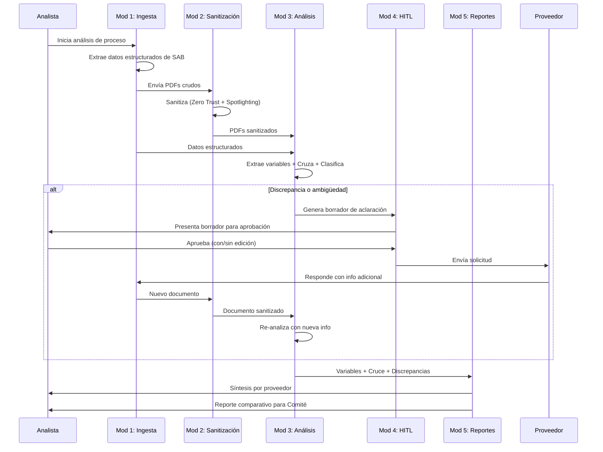

---

## 10. Métricas de Éxito

### North Star Metric

> **% de cotizaciones con auditoría completa (estructurada + no estructurada) por proceso de adquisición.**

| Atributo | Detalle |
|----------|---------|
| **Definición** | Del total de cotizaciones consolidadas en SAB para un proceso, ¿qué porcentaje fue analizado por el agente en ambas capas con confianza alta? |
| **Baseline actual** | **<20%** — *"La toma de decisiones financieras se realiza utilizando menos del 20% de los datos disponibles."* |
| **Meta MVP** | **100%** de cotizaciones procesadas. ≥95% con confianza alta. |
| **Por qué esta métrica** | Captura directamente la propuesta de valor: pasar de "el analista lee un puñado" a "el agente cubre todo." |

### KPIs de Activación

| # | KPI | Meta |
|---|-----|------|
| A1 | Tiempo al primer análisis completado | <30 minutos (incluyendo onboarding) |
| A2 | Tasa de completitud del primer portafolio | >80% de analistas completan su primer análisis |
| A3 | Tasa de adopción de aclaraciones | >60% aprueban al menos 1 borrador en su primer mes |

### KPIs de Retención

| # | KPI | Meta |
|---|-----|------|
| R1 | Tasa de uso recurrente | >70% de analistas activos son recurrentes al mes 3 |
| R2 | Cobertura de procesos | >50% de procesos al mes 3. >80% al mes 6. |
| R3 | Reducción del ciclo de evaluación | De **15 días** a **<3 días hábiles** |

### KPIs de Calidad de Producto

| # | KPI | Meta |
|---|-----|------|
| Q1 | Precisión de extracción | >96% |
| Q2 | Tasa de detección de discrepancias | >50% de procesos con al menos 1 discrepancia relevante detectada |
| Q3 | Resolución de aclaraciones pre-adjudicación | >80% |
| Q4 | Reducción de órdenes de compra defectuosas | >50% vs. baseline histórico |

### Métricas de Calidad del Agente

#### Factualidad

| Métrica | Meta |
|---------|------|
| Precisión vs. fuente | >98% |
| Tasa de alucinación | <1% |
| Consistencia del cruce (falsos positivos) | >90% |

#### Utilidad

| Métrica | Meta |
|---------|------|
| Tasa de uso de la síntesis | >90% |
| Tasa de adopción de borradores | >70% |
| NPS del analista | >40 |

#### Seguridad

| Métrica | Meta |
|---------|------|
| Attack Success Rate (ASR) de IPI | <2% |
| Incidentes de exfiltración (EchoLeak) | **0** |
| Tasa de detección de elementos adversariales | >99% |

### Estimación Bottom-Up de Mercado — Colombia

| Dimensión | Estimación |
|-----------|-----------|
| **TAM** | ~$9M USD/año (500 orgs × 10 usuarios × $150/user/mes) |
| **SAM** | ~$2.7M USD/año (30% del TAM con SAB o similar) |
| **SOM (18 meses)** | ~$144K-$216K USD/año (10-15 universidades × 8 usuarios) |

> [!WARNING]
> Cifras estimadas sin validar. Cruzar con base de clientes real de SAB antes de comprometer proyecciones financieras.

---

## 11. Plan de Evaluación del Agente

### 11.1. Dataset Inicial

| # | Corpus | Descripción | Tamaño mínimo |
|---|--------|-------------|---------------|
| **D1** | Cotizaciones reales anonimizadas | Procesos completos de SAB: datos estructurados + PDFs adjuntos. Anonimizados. | 50 procesos, ≥200 PDFs, ≥3 sectores |
| **D2** | Ground truth anotado por expertos | Subconjunto de D1 con variables extraídas manualmente por 2 analistas independientes. | 20 procesos (≥80 PDFs), concordancia inter-anotador medida |
| **D3** | Corpus adversarial (Red Team) | PDFs sintéticos con vectores de ataque: IPI, homóglifos, CDATA, instrucciones multi-idioma. | 50 PDFs adversariales, 8 categorías de ataque |

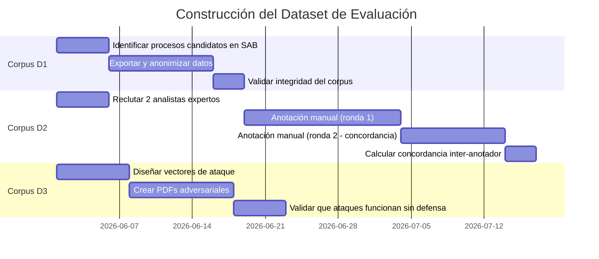

> [!IMPORTANT]
> **Sin el corpus D2 (ground truth anotado), no es posible medir la precisión del agente con rigor.** Iniciar la anotación en paralelo con el desarrollo del motor de análisis.

### 11.2. Criterios de Calidad

| # | Criterio | Métrica | Umbral |
|---|----------|---------|--------|
| **C1** | Factualidad | Precisión = variables correctas / total verificadas | >96% |
| **C2** | Adherencia a instrucciones | Tasa de cumplimiento de reglas de negocio | >99% |
| **C3** | Relevancia | Recall >95%, Precision >90% | Variables críticas detectadas vs. omitidas |
| **C4** | Consistencia | Concordancia entre ejecuciones repetidas | >95% |
| **C5** | Trazabilidad | Afirmaciones con cita verificable | 100% |

#### Umbral Go / No-Go para Lanzamiento

> [!CAUTION]
> El agente **no se lanza a producción** hasta que TODOS los criterios superen sus umbrales en el corpus D1+D2.

| Criterio que falla | Acción |
|-------------------|--------|
| C1 (Factualidad <96%) | Revisar arquitectura de extracción. No lanzar. |
| C2 (Adherencia <99%) | Bug crítico en motor de reglas. Fix obligatorio. |
| C3 (Recall <95%) | Ampliar prompt engineering o fine-tuning. |
| C4 (Consistencia <95%) | Ajustar parámetros de inferencia. |
| C5 (Trazabilidad <100%) | Violación del Principio #4. Fix obligatorio. |

### 11.3. QA de Outputs (3 Capas)

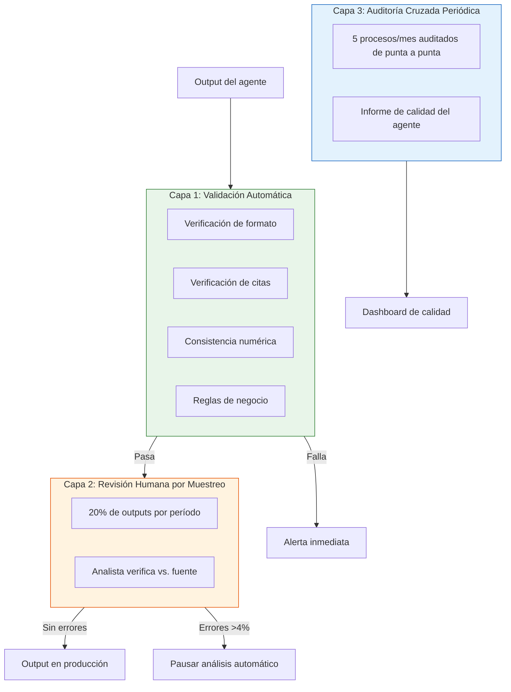

| Capa | Frecuencia | Quién | Acción si falla |
|------|-----------|-------|----------------|
| **L1: Automática** | 100%, tiempo real | Sistema | Alerta inmediata. Output marcado para revisión manual. |
| **L2: Muestreo** | 20%, semanal | Analista experto / QA | Si error >4%, se pausa análisis automático. |
| **L3: Auditoría** | 5 procesos/mes | Producto + analista senior | Informe → ajustes al prompt, reglas o modelo. |

### 11.4. Red-Teaming: Escenarios Adversariales

#### Categoría 1: Ataques de Inyección Indirecta de Prompts (IPI)

| # | Escenario | Vector | Defensa esperada |
|---|-----------|--------|-----------------|
| RT1 | CSS oculto con instrucción de override | `font-size: 0px` | Sanitización detecta CSS oculto → neutraliza |
| RT2 | Homóglifos Unicode | Caracteres cirílicos visualmente idénticos | Pipeline detecta y normaliza |
| RT3 | Inyección en metadatos SVG/CDATA | Instrucciones en metadatos de logotipo | Extrae texto solo de capas visibles |
| RT4 | Instrucción multi-idioma | Instrucciones ocultas en árabe/chino | Spotlighting prioriza instrucciones del sistema |

#### Categoría 2: Manipulación de datos

| # | Escenario | Defensa esperada |
|---|-----------|-----------------|
| RT5 | Precios contradictorios intra-documento | Detecta discrepancia → reporta ambas fuentes → escalamiento |
| RT6 | Referencia a documento inexistente | Detecta referencia no resoluble → escalamiento con confianza baja |

#### Categoría 3: Estrés operativo

| # | Escenario | Defensa esperada |
|---|-----------|-----------------|
| RT7 | PDF de 500+ páginas con OCR requerido | Procesa dentro del SLA o escala "documento excede capacidad" |
| RT8 | Portafolio de 50+ cotizaciones simultáneas | Procesamiento secuencial sin pérdida de precisión |

**Protocolo:** Pre-lanzamiento completo (8 escenarios). Post-lanzamiento trimestral. Criterio: ASR <2%, 0 exfiltraciones, 100% escalamiento correcto.

---

## 12. Riesgos y Mitigaciones

| # | Riesgo | Categoría | Prob. | Impacto | Plan de Mitigación |
|---|--------|-----------|-------|---------|-------------------|
| R1 | **IPI vía PDFs de proveedores** | Técnico / Seguridad | Alta | Alto | Pipeline Zero Trust (M3). Spotlighting. Red-teaming trimestral. HITL en comunicaciones. |
| R2 | **Alucinación del agente** | Técnico / Producto | Media | Alto | Validación cruzada. Confianza por variable (M7). QA 3 capas. Go/No-Go: precisión >96%. |
| R3 | **Sesgo algorítmico** | Producto / Ética | Media | Alto | Circuit-breakers (S2). Indicador de diversidad (S5). Auditoría periódica. |
| R4 | **Falsa sensación de cumplimiento** | Reputación / Legal | Media | Alto | Posicionamiento "no anti-fraude". Disclaimer visible. No usar "fraude" en interfaz. |
| R5 | **Dependencia de LLM de terceros** | Técnico / Mercado | Media | Medio | Capa de abstracción. Evaluación periódica de alternativas. Buffer de presupuesto 30%. |
| R6 | **Commoditización en 12 meses** | Mercado | Alta | Medio | Moat = cruce + distribución SAB. Fortalecer integración profunda. |
| R7 | **Responsabilidad legal por adjudicación defectuosa** | Legal | Baja | Alto | HITL obligatorio. Términos claros. Trazabilidad. Seguro de responsabilidad profesional. |
| R8 | **Ruptura de confianza a escala** | Reputación | Baja | Alto | Precisión >96%. Protocolo de crisis <24h. Plan de compensación. |
| R9 | **Atrofia del criterio humano** | Producto / Operativo | Media | Medio | Rotación: 1 proceso/mes sin agente. Reportes que fuerzan verificación. |
| R10 | **ERPs cierran acceso a datos** | Mercado / Técnico | Media | Medio | No aplica en Fase 1 (SAB propio). Monitorear para Fase 2. |

### Matriz Visual de Riesgo

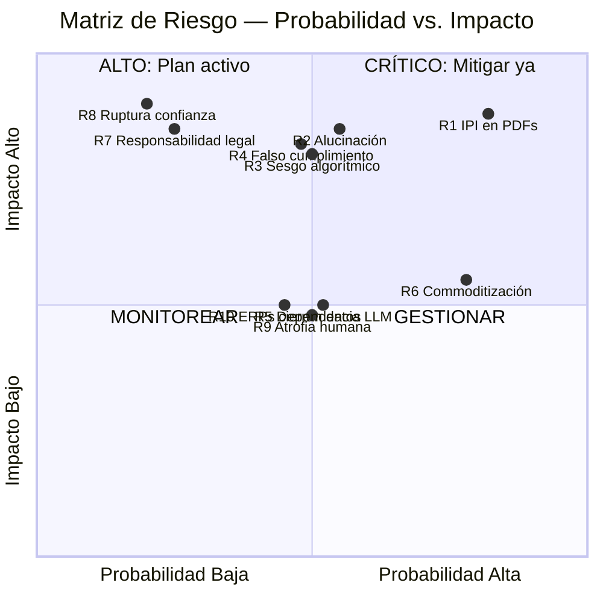

### Resumen Priorizado

| Prioridad | Riesgo | Estado de mitigación |
|-----------|--------|---------------------|
| 1 | R1 — IPI en PDFs | Pipeline Zero Trust es Must Have (M3). Red-teaming en Seg. 11. |
| 2 | R2 — Alucinación | Validación cruzada + QA 3 capas + Go/No-Go. |
| 3 | R4 — Falso cumplimiento | Posicionamiento "no anti-fraude" definido. |
| 4 | R3 — Sesgo algorítmico | Circuit-breakers (S2) como Should Have. |
| 5 | R8 — Ruptura confianza | Precisión >96% + protocolo de crisis. |
| 6 | R7 — Responsabilidad legal | HITL + términos de servicio + trazabilidad. |
| 7 | R6 — Commoditización | Moat de distribución (SAB) + cruce diferenciador. |
| 8 | R5 — Dependencia LLM | Capa de abstracción + evaluación de alternativas. |
| 9 | R9 — Atrofia humana | Revisiones manuales obligatorias + formación. |
| 10 | R10 — ERPs cierran datos | No aplica en Fase 1. Monitorear para Fase 2. |

---

## 13. Plan de Entrega 30/60/90 Días

### Vista General

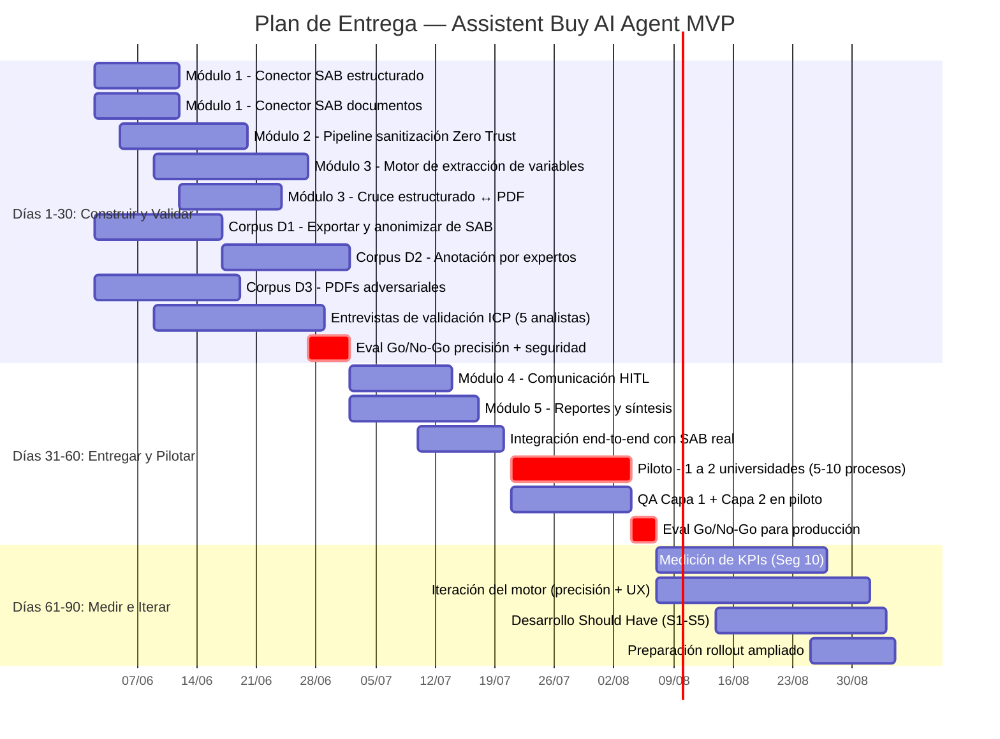

### Días 1-30 — Construir y Validar

> **Pregunta central: ¿El motor funciona con la precisión requerida y las defensas de seguridad resisten?**

#### Qué se construye

| Entregable | Módulo | Criterio de "listo" |
|-----------|--------|-------------------|
| Conector SAB — datos estructurados | Mod 1 | Extrae 100% de campos de un proceso de prueba |
| Conector SAB — documentos adjuntos | Mod 1 | Descarga 100% de PDFs de un proceso de prueba |
| Pipeline de sanitización Zero Trust | Mod 2 | Pasa 100% del corpus D3 con ASR <2% |
| Motor de extracción de variables | Mod 3 | Precisión >96% contra corpus D2 |
| Motor de cruce estructurado ↔ PDF | Mod 3 | Detecta >90% de discrepancias sembradas |

#### Qué se valida

| Validación | Criterio de éxito |
|-----------|------------------|
| Precisión del motor | >96%, Recall >95%, alucinación <1% |
| Defensas de seguridad | ASR <2%, 0 exfiltraciones, detección >99% |
| Dolor del ICP | ≥4 de 5 analistas confirman dolor de cobertura parcial |
| Viabilidad del conector SAB | Extracción completa sin errores en ≥3 procesos |

> [!IMPORTANT]
> **Gate Día 30:** Si precisión <96% o ASR >2%, NO se avanza a piloto.

#### Equipo estimado

| Rol | Dedicación |
|-----|-----------|
| Ingeniero backend (LLM / AI) | 100% |
| Ingeniero backend (integración) | 100% |
| Ingeniero de seguridad | 50% |
| Analista de compras experto | 30% |
| Product Manager | 50% |

### Días 31-60 — Entregar y Pilotar

> **Pregunta central: ¿El producto entrega valor real en un entorno de producción con datos reales?**

#### Qué se entrega

| Entregable | Criterio de "listo" |
|-----------|-------------------|
| Borradores de aclaración (Mod 4) | >70% aprobados por analista en piloto |
| Pantalla de aprobación HITL (Mod 4) | Flujo completable en <2 min por solicitud |
| Síntesis por proveedor (Mod 5) | >95% datos correctos verificados en piloto |
| Reporte comparativo (Mod 5) | Comité puede decidir sin leer PDFs manualmente |
| Integración end-to-end SAB | Flujo completo sin intervención de ingeniería |

#### Primer Piloto

| Atributo | Detalle |
|----------|---------|
| **Clientes** | 1-2 universidades colombianas con SAB |
| **Alcance** | 5-10 procesos reales en shadow mode |
| **Duración** | 2-3 semanas |
| **Modo** | Shadow: agente analiza en paralelo, decisión se toma con flujo manual |

> [!WARNING]
> **Shadow mode**: NO se toman decisiones reales basadas en el agente. Protege al cliente y permite comparar.

#### Gate Día 60

| Criterio | Umbral |
|----------|--------|
| Precisión en datos reales | >96% |
| Adopción de borradores | >60% |
| NPS del analista piloto | >0 |
| Incidentes de seguridad | 0 |
| Valor diferencial | Al menos 1 hallazgo que analista no habría encontrado solo |

### Días 61-90 — Medir e Iterar

> **Pregunta central: ¿Los datos del piloto validan las hipótesis del PRD?**

#### Qué se mide

| KPI | Meta |
|-----|------|
| North Star: Cobertura de auditoría | 100% |
| Ciclo de evaluación | <3 días hábiles |
| Precisión de extracción | >96% |
| Discrepancias detectadas | ≥1 por proceso en >50% de procesos |
| Adopción de aclaraciones | >70% |
| Factualidad | >98% vs. fuente, <1% alucinación |
| Seguridad | ASR <2%, 0 exfiltraciones |

#### Iteración basada en datos del piloto

| Dato | Acción |
|------|--------|
| Variables extraídas incorrectamente con frecuencia | Ajustar prompts, agregar few-shot |
| Borradores siempre editados de la misma forma | Incorporar patrones al template |
| Discrepancias "falso positivo" | Ajustar umbrales de severidad |
| PDFs problemáticos para sanitizador | Ampliar corpus D3 |
| Feedback de UX (fricción, lentitud) | Iteración de interfaz |

#### Should Have a construir

| Feature | Justificación |
|---------|--------------|
| S3: Dashboard de métricas | Los datos del piloto necesitan visualización |
| S4: Reglas de negocio configurables | Piloto revela qué debe ser configurable |
| S1: Anomalías históricas | Si hay ≥3 meses de datos acumulados |
| S2: Circuit-breakers | Depende de S1 |
| S5: Indicador de diversidad | Complemento del dashboard |

#### Preparación para Rollout Ampliado

| Actividad | Descripción |
|-----------|-------------|
| Documentación de onboarding | Guía para nuevos clientes SAB |
| Pricing validado | Contrastar $150/user/mes con willingness-to-pay del piloto |
| Pipeline de ventas | 5-10 instituciones adicionales del install-base de SAB |
| Plan de soporte | SLAs basados en volumen real del piloto |

### Dependencias Críticas

| # | Dependencia | Fecha límite | Plan B |
|---|-----------|-------------|--------|
| 1 | Acceso a instancia de desarrollo de SAB | Día 1 | Exports estáticos (CSV + PDFs) como mock |
| 2 | 2 analistas expertos para corpus D2 | Día 5 | Reducir D2 a 10 procesos (menos robusto) |
| 3 | Acuerdo con universidades para piloto | Día 25 | Piloto interno con datos anonimizados |
| 4 | Acceso a modelo LLM con capacidad suficiente | Día 1 | Evaluar ≥2 proveedores en paralelo |

### Resumen Visual

| Fase | Duración | Foco | Gate |
|------|----------|------|------|
| **Construir** | Días 1-30 | Motor core + datasets + validación ICP | Precisión >96%, ASR <2% |
| **Pilotar** | Días 31-60 | Producto completo + piloto real en shadow | NPS >0, precisión >96%, 0 incidentes |
| **Iterar** | Días 61-90 | Medir KPIs + iterar + Should Have | Métricas en tendencia positiva |

---

## Anexo: Análisis de Conflictos (Paso 0)

Los siguientes conflictos fueron identificados y resueltos antes de la elaboración del PRD:

| # | Tipo | Conflicto | Decisión |
|---|------|-----------|----------|
| 1 | Contradicción de posicionamiento | "Capa liviana" vs. "integración profunda con SAB" | MVP como capa liviana read-only sobre SAB. La integración profunda es de lectura, no de escritura. |
| 2 | Contradicción de datos | Latencia "3-5 min" vs. "<60s por portafolio denso" | SLA de 60s por portafolio denso como target. Se acepta excepción para documentos extremos. |
| 3 | Conflicto de posicionamiento | ¿Anti-fraude o riesgo documental? | Riesgo documental + anomalías. NUNCA anti-fraude. |
| 4 | Señales contradictorias | Competidores: ¿Wherex es competencia directa o tangencial? | Tangencial. Assistent Buy opera en una capa diferente. |
| 5 | Supuestos incompatibles | Autonomía del agente vs. seguridad (HITL) | HITL obligatorio para comunicaciones externas. |
| 6 | Vacío crítico | TAM/SAM/SOM sin datos de mercado Colombia | Estimación bottom-up con advertencias. Validar con base de clientes real de SAB. |
| 7 | Vacío crítico | Sin transcripciones reales de usuarios | 5 entrevistas de validación pre-piloto obligatorias. |
| 8 | Vacío crítico | Sin benchmark de precisión empírico | >96% es target aspiracional. Medición real con corpus D2. |
| 9 | Vacío crítico | Sin pricing competitivo validado | Pricing de $150/user/mes a validar en piloto. |
| 10 | Supuesto incompatible | MVP solo SAB vs. arquitectura agnóstica | MVP con SAB. Arquitectura con capa de abstracción para conectores futuros. |

---

*Documento generado consolidando los artefactos de la co-creación iterativa (Paso 0 + Segmentos 1-13).*
